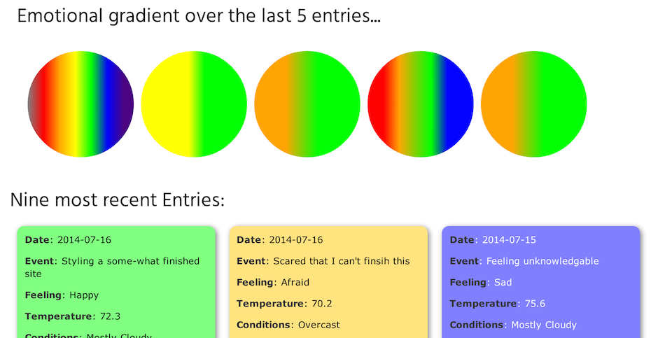

##Personality Palette
-------
  
picture is worth a thousand words...

  

  

  
---------
Personality Palette is an journal-based emotion mapping app.  It generates gradients of days with entries to give an overall idea of how that day went for you.

---------

Favorite line of code:
In trying to make the site more responsive to mobile, I kept running a problem where wheter on my actual mobile or in emulation, the page wasn't rendering correctly.  This was all due to the high dpi on current devices.  The fix was one simple line of code.

`<meta name="viewport" content="width=320; initial-scale=1.0; maximum-scale=2.0; user-scalable=2;"/>`

Adjusting the user-scalable allowed skeleton to work its magic and created the responsive design change I was aiming for... for a while.

---------
Technologies used:

*	Ruby on Rails
*	JavaScript: jQuery, d3
*	Google geolocation API
*	underground Weather API

Future iterations will include

*	entries mapped to locations
*	proportional gradients to quanities of mood ticks
*	single page backbone.js routing
*	calendar with emotional gradients for overall reference

---------
project hosted at [http://personality-palette.herokuapp.com](http://personality-palette.herokuapp.com/)

source code available on [github.com/ntuvera](http://github.com/ntuvera/personality_palette/)
